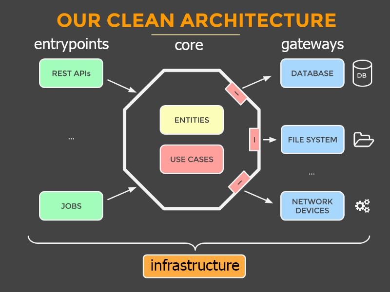

# Backend

## Architecture Overview

This folder contains the backend code for our application. The architecture is organized to separate concerns and follow the principles of clean architecture.



### Directory Structure

```bash
src/
├── application                    # Core business logic
│   ├── errors                  # Domain-specific error definitions
│   ├── services                # Business services (reusable logic)
│   └── useCases                # Use cases (specific application logic)
├── domain                    # Core business logic
│   ├── entities                # Domain entities and value objects
│   └── interfaces             # Interfaces and adapters
├── entrypoints             # Application entry points
│   ├── api                     # API and routes
│   └── ...                     # ... can be jobs, queues consumer, cli...
├── gateways                # Gateways interface adapter to interact with external services
│   ├── repositories            # Repositories for data persistence
│   ├── logger                  # Logging service
│   ├── cache                   # Cache database
│   └── helpers                 # Helpers for gateways and entrypoints
│      ├── database                 # Helpers for gateways and entrypoints
│      ├── mailer                  # Email sending service
│      └── ...                     # Can be other services
├── config          # Everything that wires the application, configuration
│   ├── config                  # Configuration files
│   ├── di                      # Dependency injection setup
│   ├── sdkGenerator            # SDK generation scripts
│   └── tests                   # Test helpers and configuration
└── utils                   # Utility tools and functions
```

## Règles de l'architecture

Dans notre applications, nous avons 3 groupements principaux :

- `couches internes` : qui sont composé du `domain` et de l'`application`
- `couches externes` : qui sont composé du `entrypoints` et des `gateways`
- `couche transverse` : qui est composé de la `configuration`, des `tests` et des `outils` utiles

Le principe de l'architecture est de séparer les responsabilités, de faciliter les tests et de favoriser la réutilisation du code.

### Le **domain**

La couche domaine est la couche la plus interne de notre application. Elle doit être indépendante de toute autre couche.

#### Composition :

- **Entités** : qui sont les objets de notre application. Ces objets sont composé des paramètres qui les composent, mais aussi de méthodes qui permettent certaines actions métiers.
- **Interfaces** : qui sont les interfaces que la couche `application` va se servir pour faire appel aux services externes. Elles vont servir de contrat entre la couche interne et la couche externe.

#### Règles relatives au `domain` :

- Le `domain` ne doit dépendre d'aucune dépendance externe.
- Le `domain` peut être utilisé par toutes les couches

### La couche `application`

La couche `application` permet d'orchestrer les actions métiers de notre application.

#### Composition :

- **Use cases** : qui sont des méthodes qui permettent d'orchestrer les actions métiers de notre application.
- **Services** : qui sont des partie de ces actions métiers, regroupées par thématique afin d'être rapidement trouvées et réutilisées.
- **Errors** : qui sont les erreurs métiers de notre application.

#### Règles relatives à la couche `application` :

- La couche `application` peut utiliser les `entités` et les `interfaces` du `domain`.
- La couche `application` ne doit pas être appelé par la couche `gateways`.
- La couche `application` ne peut pas les couches externes sauf via les `interfaces` du `domain` et c'est uniquement valable pour la couche `gateway`. Le but de cette maneuvre est de conserver la maitrise ce ce dont à besoin le métier pour fonctionner en utilisant des acces externe comme la bdd, l'envoie de mail, etc...
- La couche `application` ne peut pas être appelé par la couche `gateways`.


## API Naming Convention

### Route and URL naming

For API routes and URLs, we use the following conventions:

| Description            | Route Name                 | URL Path                        |
| -----------------------| ---------------------------| ------------------------------- |
| Login request          | `authLogin`                | `/auth/login`                   |
| Signup request         | `authSignup`               | `/auth/signup`                  |
| Password reset request | `authPasswordResetRequest` | `/auth/password-reset-request`  |
| Update profile         | `userUpdateProfile`        | `/user/update-profile`          |
| Delete product         | `productDelete`            | `/product/delete`               |
| Get user profile       | `userGetProfile`           | `/user/profile`                 |
| Create product         | `productCreate`            | `/product/create`               |
| List orders            | `orderList`                | `/order/list`                   |
| Update settings        | `settingsUpdate`           | `/settings/update`              |

Route naming convention: `<business><actions (2-3 words)>`, in **camelCase**
URL path convention: `/<business>/<action>` in **kebab-case**

### Route authorization groups

Routes are prefixed with one of the following authorization levels:

- `admin`: Only accessible by administrators
- `internal`: For internal system use only (auth withapi key, webhooks, ...)
- `protected`: Requires user authentication
- `public`: Accessible without authentication

